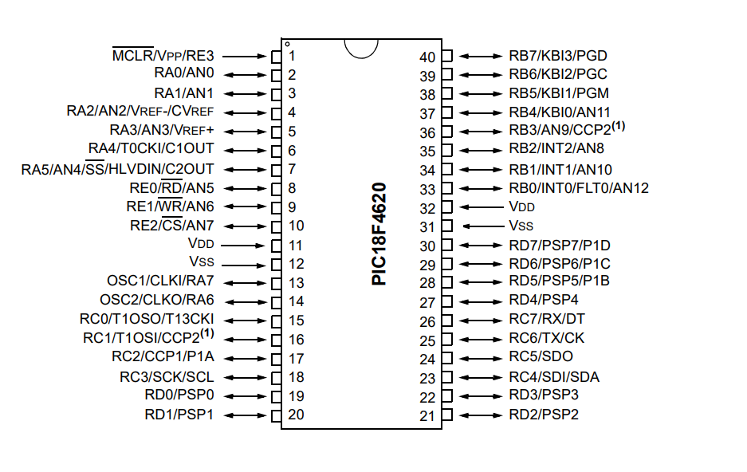

  

# *PIC18_F4620*
 my PIC18F4620 drivers journey. Effortlessly integrate microcontroller peripherals. Simplify development with clear documentation and modular code for smooth hardware interaction."

## Layered Architecture

The driver is structured into the following layers:

### [MCAL (Microcontroller Abstraction Layer)](MCAL/)

- [GPIO](MCAL/GPIO/): General-Purpose Input/Output module.

### [ECU (Electronic Control Unit) Layer](ECU/)

- [LCD](ECU/LCD/): Character LCD display control module.
- [KEYPAD](ECU/KEYPAD/): Keypad control module.
- [DC_MOTOR](ECU/DC_MOTOR/): DC motor control module.
- [RELAY](ECU/RELAY/): Relay control module.
- [SEVEN_SEGMENTS](ECU/SEVEN_SEGMENTS/): Seven-segment display control module.
- [BUTTON](ECU/BUTTON/): Button control module.
- [LED](ECU/LED/): LED control module.

### Application Layer

- [application.c](application.c): Main application code file.
- [application.h](application.h): Header file for the application code.
- [Apps](Apps/): Directory containing application-specific labs or mini-apps.

## Contributing
Contributions are welcome!

#### License
licensed under the MIT License.

